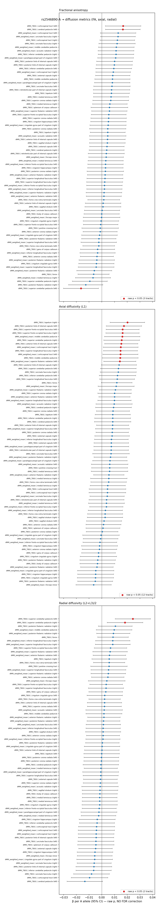
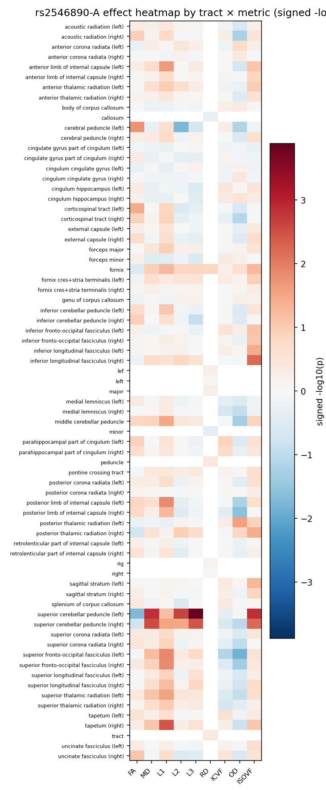
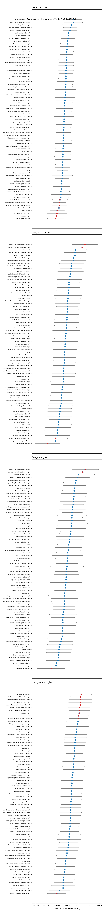
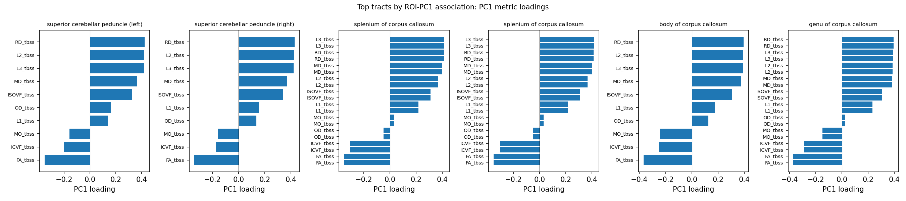
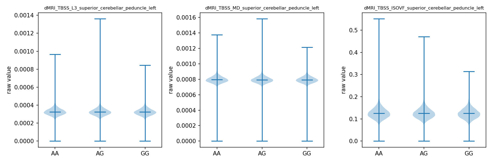
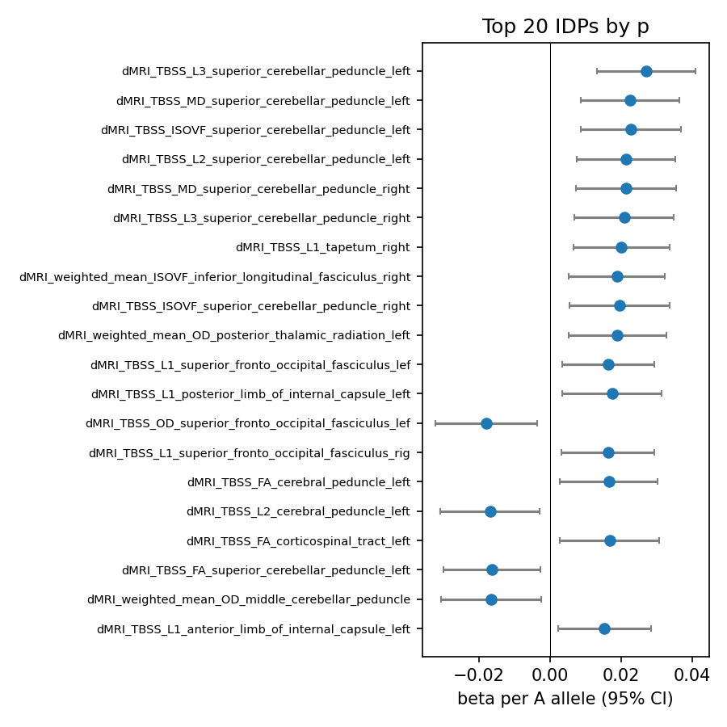

# rs2546890-A, white-matter vulnerability, and MS risk

Generated from the completed `lnc_rna_mri` pipeline outputs on 2026-05-23.

## Executive Summary

The working story is that **rs2546890-A** marks a modest but coherent vulnerability axis for multiple sclerosis and demyelination-relevant white-matter biology. The disease result is small, as expected for a common allele, but directionally consistent: the A allele is associated with higher MS risk in the full white-British LMM/Firth analysis and in the unrelated-cohort logistic sensitivity model.

The MRI signal is not a global brain-volume or white-matter-hyperintensity signal. It concentrates in diffusion MRI phenotypes from long white-matter pathways: the **left cerebral peduncle**, **left corticospinal tract**, **posterior thalamic radiation**, **uncinate fasciculus**, **forceps/callosal tracts**, and a focused REGENIE/LMM signal in the **superior cerebellar peduncles**. These are biologically plausible tracts for motor, projection, callosal, cerebellar, and association-network vulnerability in demyelinating disease.

The strongest targeted diffusion pattern is **higher FA with lower RD/MD** in the left cerebral peduncle, plus related tract-level signals. That pattern should not be called direct demyelination. UK Biobank diffusion IDPs are indirect microstructure measures, not myelin-specific measurements. The more defensible interpretation is that rs2546890-A is associated with altered white-matter microstructure in tracts that may be vulnerable in MS, and that this tract phenotype converges with a small increase in MS risk.

All p values below are **raw p values only**. No FDR, Bonferroni, or adjusted-p correction is used in this report.

## Variant and Cohort

The variant tested was `rs2546890`, modeled as A-allele dosage.

| item | value |
|---|---:|
| Variant | rs2546890 |
| GRCh38 position | chr5:159332892 |
| Effect allele | A |
| Other allele | G |
| Estimated A-allele frequency | 0.516 |
| INFO / MFI | 1.0 |
| Hardcall AA / AG / GG | 130,414 / 242,210 / 114,785 |
| HWE p | 0.000361 |

The imaging analysis used a white-British analysis set with unrelated-individual OLS and a larger kinship-tolerant LMM set.

| step | n |
|---|---:|
| Genotype input | 487,409 |
| Merged genotype/phenotype/covariate data | 487,150 |
| White British via SQC | 430,518 |
| OLS unrelated set | 399,161 |
| LMM keep set | 430,354 |

## How the Phenotypes Were Measured

The MRI traits are UK Biobank imaging-derived phenotypes (IDPs). The most relevant IDPs here are diffusion MRI summaries from tract skeletons and tractography-weighted white-matter regions.

Key metrics:

| metric | interpretation in this report |
|---|---|
| FA | Fractional anisotropy. Higher values often indicate more directional water diffusion, but can reflect fiber coherence, packing, crossing fibers, or pathology. |
| MD | Mean diffusivity. Higher values can reflect less restricted diffusion, edema, tissue loss, or free water. |
| L1 / axial diffusivity | Principal diffusion eigenvalue. Often used as directional context rather than a specific myelin marker. |
| RD | Derived as `(L2 + L3) / 2`. Higher RD is often discussed as demyelination-sensitive, but it is not specific. |
| ICVF | Intracellular volume fraction from NODDI-style modeling, used here as axon-packing context. |
| ISOVF | Isotropic/free-water volume fraction, used here as free-water or extracellular-water context. |
| Composite scores | Derived tract-level scores combining related diffusion features into demyelination-like, free-water-like, axonal-loss-like, and tract-geometry-like summaries. |

The models used:

| analysis | purpose |
|---|---|
| Additive OLS | Primary broad scan over IDPs in unrelated individuals. |
| Pairwise AA/AG/GG contrasts | Genotype-group sensitivity analyses for additivity and genotype-specific trends. |
| REGENIE/LMM | Focused kinship-aware validation for selected composite, ROI-PCA, and control phenotypes. |
| MS logistic / REGENIE binary trait | Disease-risk validation using MS case status. |

## Affected Tracts and IDPs

The most legible single-IDP finding is in the **left cerebral peduncle**, where the A allele is associated with higher FA and lower RD/MD. The left cerebral peduncle carries major descending motor fibers, so this points to a projection-tract microstructure signal rather than a diffuse, nonspecific MRI artifact.

| tract / IDP | model | n | beta per A | raw p | interpretation |
|---|---:|---:|---:|---:|---|
| Left cerebral peduncle FA | OLS | 32,560 | +0.0272 | 9.12e-05 | Strongest targeted single-IDP signal; higher directional diffusion. |
| Left cerebral peduncle RD | OLS | 32,558 | -0.0259 | 2.14e-04 | Lower radial diffusivity; direction is compatible with altered compactness/coherence rather than active demyelination. |
| Left cerebral peduncle MD | OLS | 32,555 | -0.0163 | 0.0220 | Lower mean diffusivity; supports a restricted-diffusion microstructure pattern. |
| Left corticospinal tract FA | OLS | 32,565 | +0.0186 | 0.0110 | Motor/projection-tract extension of the peduncle signal. |
| Right uncinate fasciculus FA | OLS | 32,561 | +0.0168 | 0.0187 | Association-tract context; suggests the signal is not purely motor. |
| Right posterior thalamic radiation ISOVF | OLS | 32,557 | +0.0158 | 0.0218 | Free-water/NODDI context in a projection radiation. |
| Left posterior thalamic radiation L1 | OLS | 32,555 | -0.0134 | 0.0274 | Directional diffusivity context in a projection radiation. |

The heatmap emphasizes that the signal is tract- and metric-specific. It is not a uniform shift across every diffusion phenotype. The strongest tract-level pattern is concentrated in a small set of projection and association pathways.

## Composite and LMM Evidence

The focused REGENIE/LMM run gives a second layer of evidence in the **superior cerebellar peduncle**. This is a smaller phenotype set than the full OLS scan, but it uses the larger LMM keep set and a kinship-aware model.

| composite / ROI-PCA phenotype | n | beta per A | raw p | note |
|---|---:|---:|---:|---|
| Demyelination-like, superior cerebellar peduncle left | 39,218 | -0.0220 | 0.000939 | Top LMM composite result. |
| Free-water-like, superior cerebellar peduncle right | 39,218 | -0.0220 | 0.00121 | Bilateral cerebellar-peduncle support. |
| Free-water-like, superior cerebellar peduncle left | 39,218 | -0.0216 | 0.00138 | Same tract family and similar direction. |
| Demyelination-like, superior cerebellar peduncle right | 39,218 | -0.0200 | 0.00272 | Bilateral composite support. |
| Superior cerebellar peduncle left PC1 | 39,218 | -0.0215 | 0.00120 | ROI-PCA validation of the same tract focus. |
| Superior cerebellar peduncle right PC1 | 39,218 | -0.0188 | 0.00490 | Bilateral ROI-PCA support. |

The important point is not that one composite proves myelin loss. It does not. The point is that the A allele repeatedly touches white-matter microstructure summaries in anatomically meaningful tracts: cerebral peduncle/corticospinal pathways in OLS, superior cerebellar peduncles in LMM composites, and forceps/callosal tracts in genotype-pairwise contrasts.

## Genotype-Group Pattern

The pairwise genotype analysis asks whether AA, AG, and GG individuals differ in the expected direction, rather than relying only on a single additive coefficient. The top AA-vs-GG diffusion contrasts bring in callosal and forceps phenotypes, which are relevant because corpus-callosum and interhemispheric fibers are common sites of demyelination-sensitive MRI abnormalities.

| phenotype | contrast | n | beta | raw p | interpretation |
|---|---|---:|---:|---:|---|
| Splenium RD | AA vs GG | 30,126 | -0.0314 | 0.0346 | Lower RD in AA than GG. |
| Splenium FA | AA vs GG | 30,134 | +0.0326 | 0.0350 | Higher FA in AA than GG. |
| Forceps major FA | AA vs GG | 30,148 | +0.0318 | 0.0356 | Tractography-weighted callosal replication context. |
| Forceps major RD | AA vs GG | 30,145 | -0.0319 | 0.0365 | Directionally paired with forceps FA. |

This supports a common thread: the A allele does not simply increase all diffusion metrics. Instead, it tends to show a structured pattern of higher FA and lower RD in selected long tracts. That pattern may reflect more coherent, compact, or developmentally altered tract architecture. In an MS-risk context, the plausible vulnerability model is that these tracts sit on a different microstructural baseline or repair/injury-response axis before clinical disease.

## MS Disease-Risk Signal

The MS phenotype was built from UKB disease sources:

| source | count |
|---|---:|
| ICD-10 G35 | 2,190 |
| Self-report code 1261 | 1,856 |
| First occurrence | 5,217 |
| Union MS cases in basket | 5,217 |

The strongest disease-risk estimate is the REGENIE binary-trait Firth model, which used the full LMM keep set.

| model | n | cases / controls | OR per A | 95% CI | raw p |
|---|---:|---:|---:|---:|---:|
| REGENIE-BT Firth additive | 430,354 | 4,431 / 425,923 | 1.043 | 1.000-1.088 | 0.0492 |
| Logistic additive sensitivity | 399,161 | 4,101 / 395,060 | 1.048 | 1.003-1.095 | 0.0347 |
| Logistic dominant A | 399,161 | 4,101 / 395,060 | 1.089 | 1.011-1.174 | 0.0246 |
| Logistic AA vs GG | 200,287 | 2,031 / 198,256 | 1.104 | 1.011-1.206 | 0.0274 |
| Logistic AG vs GG | 291,325 | 2,960 / 288,365 | 1.081 | 0.999-1.170 | 0.0528 |
| Logistic AA vs AG | 306,710 | 3,211 / 303,499 | 1.019 | 0.947-1.096 | 0.6128 |

The disease-risk result is small, but it matters because it points in the same broad biological direction as the MRI analysis: this allele is not just an imaging association with no disease anchor. It also carries a modest MS-risk signal.

## What the Story Means

The best current interpretation is:

1. **rs2546890-A is a modest MS-risk allele in this analysis.** The REGENIE-BT result is borderline by raw p value, but it is supported by the unrelated-cohort logistic sensitivity model and genotype-pairwise disease contrasts.

2. **The same allele is associated with tract-specific white-matter microstructure differences.** The most reproducible story is not a whole-brain shift; it is a pattern across projection, cerebellar, callosal, and association tracts.

3. **The MRI pattern is demyelination-relevant, not a direct demyelination measurement.** Higher FA with lower RD/MD in selected tracts can be discussed in relation to myelin-sensitive biology, but it can also reflect tract geometry, fiber coherence, axonal packing, crossing fibers, and free-water differences.

4. **A plausible vulnerability model is developmental or susceptibility-based.** The allele may influence baseline white-matter architecture, immune-glial biology, repair capacity, or tissue response to inflammatory injury. Under this model, MRI differences are not necessarily lesions themselves; they are a measurable substrate that may make specific tracts more susceptible or alter how disease manifests.

5. **The convergence is the important result.** The variant has a small MS-risk signal, affects white-matter IDPs in biologically plausible tracts, and shows genotype-group patterns in callosal/forceps measures. That convergence supports prioritizing rs2546890-A for follow-up in direct-myelin or MS-enriched imaging data.

## Limitations

- These are **raw p values only** by design. The report does not use FDR, Bonferroni, or other adjusted-p correction.
- UKB diffusion MRI IDPs are indirect. They do not directly measure myelin content.
- The strongest OLS single-IDP signals and the focused LMM composite signals are not identical phenotype sets. Treat them as convergent but not interchangeable evidence.
- The final REGENIE/LMM imaging run was focused and successful for selected composite/ROI-PCA/control phenotypes, not the full 647-phenotype OLS panel.
- The MS-risk effect size is small. This is expected for a common allele, but it means the biological story should be treated as a prioritized hypothesis rather than a proven mechanism.
- WMH volume was not associated with the allele in the focused LMM control result (`raw p = 0.953`), arguing against a simple gross white-matter-lesion-burden explanation in this dataset.

## Source Files

Primary source tables:

- `results/association_results_primary.csv`
- `results/targeted_diffusion_check.csv`
- `results/association_results_composites.csv`
- `results/association_results_pairwise_genotype.csv`
- `results/association_results_composites_lmm.csv`
- `results/association_results_roi_pca_lmm.csv`
- `results/association_ms_risk.csv`
- `results/association_ms_risk_lmm.csv`

Embedded figures:

- `figures/targeted_diffusion_forest.png`
- `figures/effect_heatmap_by_tract_metric.png`
- `figures/composite_effects_forest.png`
- `figures/top_roi_pca_loadings.png`
- `figures/genotype_violin_top3.png`
- `figures/effect_size_forest_top_hits.png`
